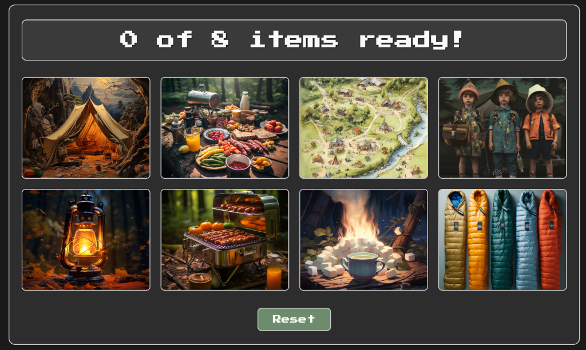
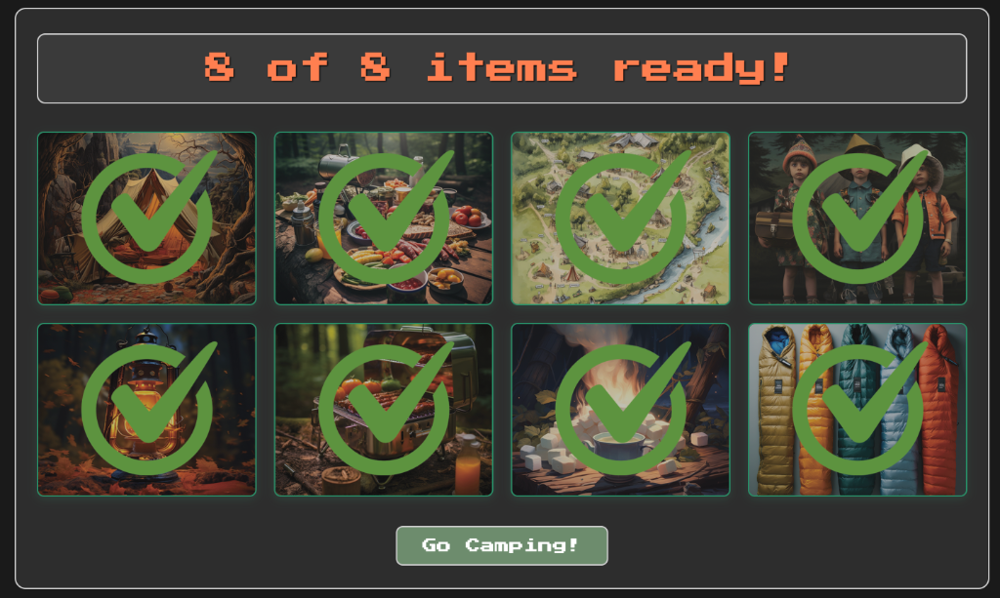
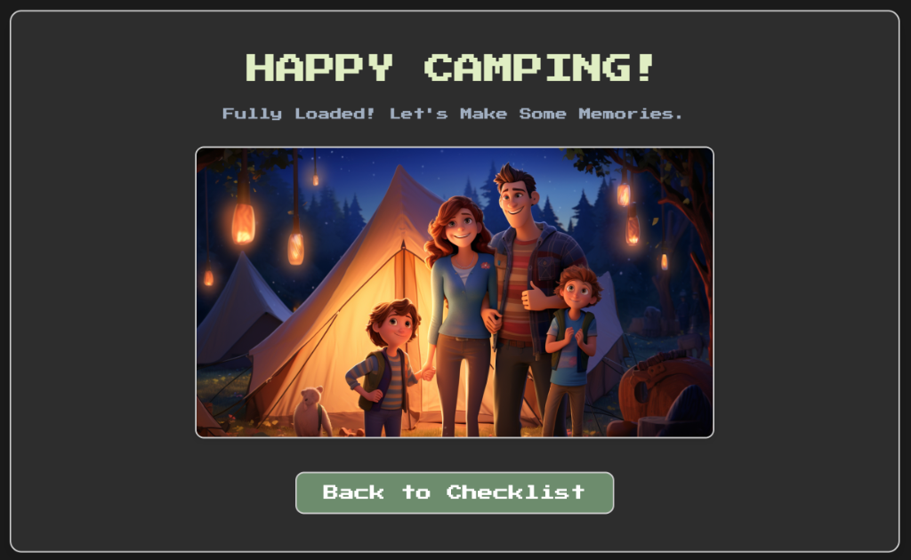

# 🌲 Camp Prepper — Interactive Outdoor Gear Checklist

[](https://developer.mozilla.org/en-US/docs/Web/JavaScript)
[](https://developer.mozilla.org/en-US/docs/Web/HTML)
[](https://developer.mozilla.org/en-US/docs/Web/CSS)
[](#responsive-web-design)
[](LICENSE)

An interactive, retro-themed web application designed to help campers prepare essential gear before their trip. Built with vanilla JavaScript, dynamic DOM manipulation, real-time status tracking, and an 8-bit arcade aesthetic.

---

## 📸 Visual Guide & User Walkthrough

### 1. Initial State: Unpacked Checklist
When the application loads, all 8 gear items are displayed in their unprepared state. The top counter shows `0 of 8 items ready!` and the primary action button defaults to `Reset`.

<div align="center">
  
</div>

- **Interactive Grid**: Clicking any item image toggles its status.
- **Dynamic Counter**: Increments in real-time as items are marked ready.

---

### 2. Active Selection & Full Readiness (8 of 8 Ready)
As the user clicks each camping essential (tent, food supplies, trail map, hiking crew, lantern, grill, campfire, sleeping bags), the UI updates dynamically:

<div align="center">
  
</div>

- **Visual Feedback**: Each selected item reveals a distinctive green checkmark overlay and green border glow.
- **Dynamic CTA State Shift**: The counter highlights in coral orange (`8 of 8 items ready!`) and the button automatically transforms from `Reset` to **`Go Camping!`**.

---

### 3. Celebration & Destination View (`camping.html`)
Clicking the `Go Camping!` button transitions the user to the destination celebration page, confirming all gear is packed and ready for the outdoor adventure.

<div align="center">
  
</div>

- **Celebration Hero**: Displays a celebratory high-resolution camping visual.
- **Seamless Navigation**: Provides a `Back to Checklist` navigation button to reset and start a new trip checklist.

---

## ✨ Key Features & JavaScript Concepts Demonstrated

| Feature | Technical Implementation |
| :--- | :--- |
| **DOM Event Delegation & Handling** | `addEventListener` on `DOMContentLoaded` and individual item clicks |
| **Dynamic Asset Swapping** | Dynamic string replacement for `src` attributes (`.png` $\leftrightarrow$ `_checked.png`) |
| **Reactive State Engine** | Centralized item counter and status evaluator (`updatePreparationStatus`) |
| **Class State Management** | `classList.add`, `classList.remove`, and `classList.contains` |
| **Conditional Flow Control** | Dynamic UI state transitions based on checklist completion threshold ($8/8$) |
| **Multi-Page Routing** | Programmatic navigation via `document.location.assign('camping.html')` |

---

## 📱 Responsive Web Design

The interface adapts seamlessly across all viewport sizes using modern CSS techniques:
- **Fluid Layout**: Built with CSS Grid and dynamic column wrapping:
  - **Desktop ($\ge 900\text{px}$)**: 4-column item grid.
  - **Tablet ($540\text{px} - 900\text{px}$)**: 2-column item grid.
  - **Mobile ($< 540\text{px}$)**: Single-column stacked card layout.
- **Fluid Typography**: Uses CSS `clamp()` for crisp readability across mobile and desktop displays without overflow.
- **Touch-Optimized**: High contrast tap targets and hover/active animations for touch and desktop input.

---

## 📂 Project Structure

```text
camp-prepper/
├── assets/
│   ├── images/          # Gear item thumbnails, checkmarks, and banners
│   └── screenshots/     # Visual documentation and state walkthrough captures
│       ├── 01-initial-state.png
│       ├── 02-completed-state.png
│       └── 03-celebration-page.png
├── css/
│   └── app.css          # Responsive styling, CSS Grid, and retro typography
├── js/
│   ├── app.js           # Core checklist logic, state manager, and DOM manipulation
│   └── jquery.js        # Supporting utility library
├── camping.html         # Celebration & completion landing view
├── index.html           # Main interactive checklist entry point
├── LICENSE              # MIT License
├── .gitignore           # Git ignore configuration
└── README.md            # Project documentation & visual guide
```

---

## 🚀 Getting Started

### Prerequisites
No build tools, bundlers, or package installations are required. Just a modern web browser.

### Local Installation & Launch
1. Clone the repository:
   ```bash
   git clone https://github.com/your-username/camp-prepper.git
   cd camp-prepper
   ```
2. Open `index.html` in your favorite browser:
   ```bash
   # On macOS:
   open index.html

   # On Linux:
   xdg-open index.html

   # On Windows:
   start index.html
   ```

---

## 🛠️ Built With

- **HTML5**: Semantic document structure
- **CSS3**: CSS Grid, Flexbox, Transitions, `clamp()` fluid typography
- **JavaScript (ES6+)**: Event listeners, dynamic DOM manipulation, state logic
- **Google Fonts**: [Press Start 2P](https://fonts.google.com/specimen/Press+Start+2P)

---

## 📄 License

This project is open source and available under the [MIT License](LICENSE).
